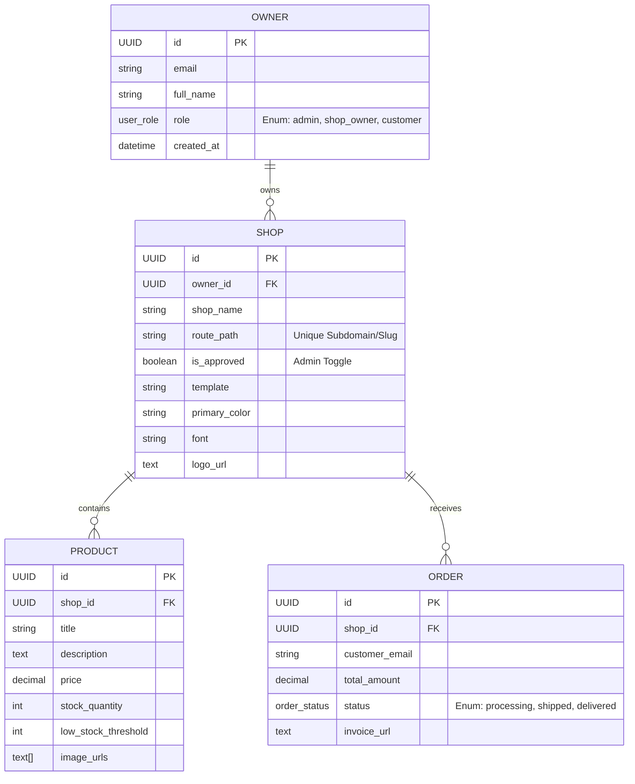
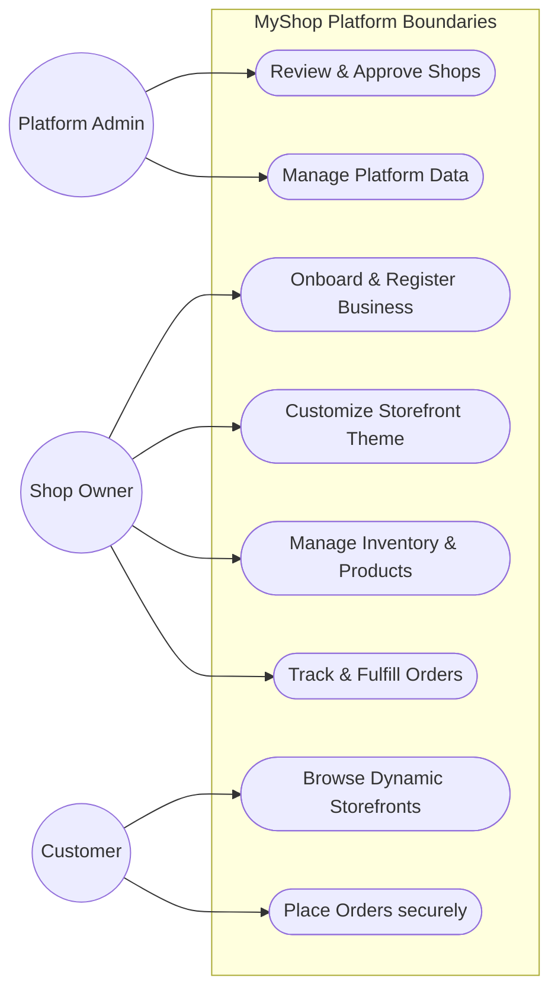
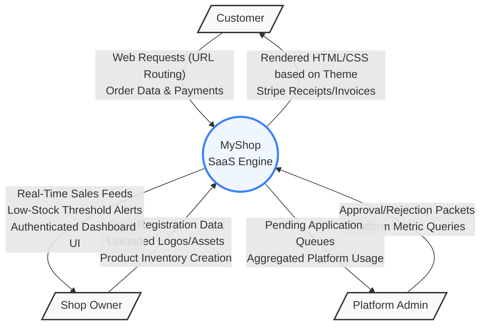

# MyShop Platform Architecture Diagrams

This document contains key system architecture diagrams for the MyShop e-commerce SaaS platform, generated based on the database schema and system logic.

## 1. Entity Relationship Diagram (ERD)

This ERD visualizes the core PostgreSQL database schema tables (`owners`, `shops`, `products`, `orders`) and how they relate to one another via foreign keys.

## 2. Use Case Diagram

This diagram maps the three primary actors (`Platform Admin`, `Shop Owner`, `Customer`) to their respective capabilities within the system perimeter.

## 3. Data Flow Diagram (DFD Level 0)

This Level 0 Data Flow (Context) Diagram illustrates the high-level flow of information between external entities and the core centralized MyShop engine.

